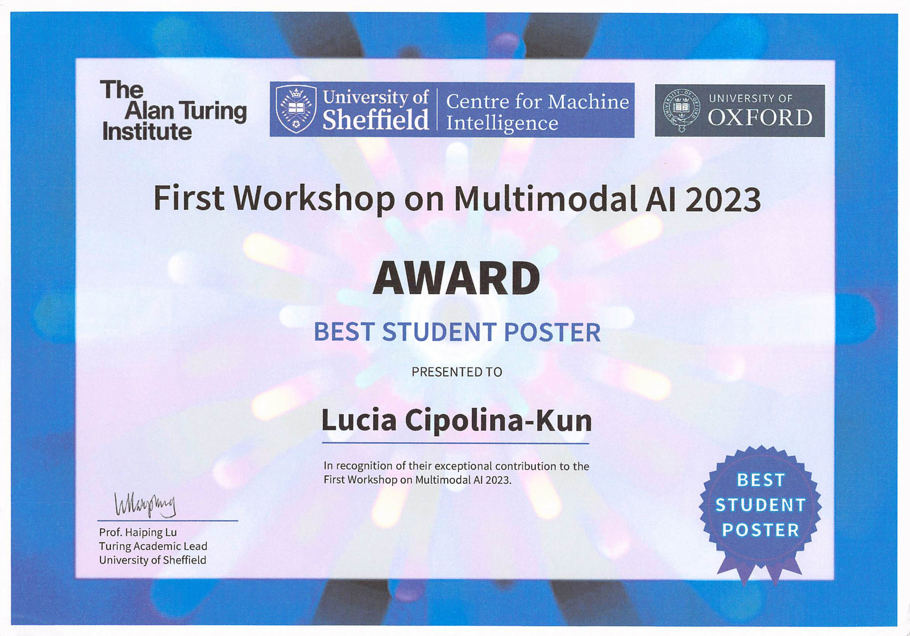

## Best Student Poster Award at the First Workshop of Multimodal AI 2023

I am delighted to share that my collaborators and I have been awarded the **Best Student Poster Award** at the **[First Workshop of Multimodal AI](https://multimodalai.github.io/multimodalai23/)**.
The poster includes two works on Diffusion Models applied to [Inpainting](https://openaccess.thecvf.com/content/CVPR2022W/NTIRE/papers/Cipolina-Kun_Comparison_of_CoModGans_LaMa_and_GLIDE_for_Art_Inpainting_Completing_CVPRW_2022_paper.pdf) and [Image Candidate Selection](https://research.latinxinai.org/papers/icml/2022/pdf/paper_3.pdf).

Our work introduces diffusion models for the restoration and preservation of cultural heritage pieces, in particular, the reconstruction of ancient paintings.

### Summary of the work.
Within the field of Cultural Heritage, image inpainting is a conservation process that fills in missing or damaged parts of an artwork to present a complete image. Multi-modal diffusion models have brought photo-realistic results on image inpainting where content can be generated by using descriptive text prompts. Additionally, generative models produce many plausible outputs for a given prompt. Our work presents a methodology to improve the inpainting of fine art by automating the selection process of inpainted candidates. We propose a discriminator model that processes the output of inpainting models and assigns a probability that indicates the likelihood that the restored image belongs to a certain painter.

