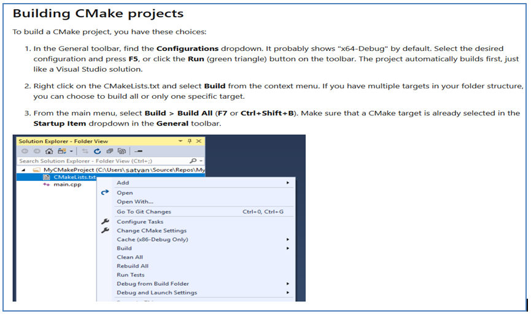
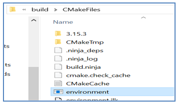
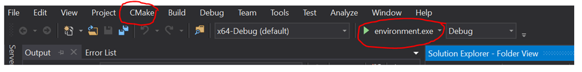

The first step in Udacity's *Sensor Fusion* course is to compile their CMAKE file to create the driving environment. 

This blog entry details the steps to compile the CMAKE file on your Windows computer.

The idea is to build the CMAKE file using Visual Studio directly. To do so, the first step is to follow the compilation steps explained on this link:

[link to compile CMAKE in VS](https://docs.microsoft.com/en-us/cpp/build/cmake-projects-in-visual-studio?view=vs-2019)

## 3 Basic steps:

1. Download "C++ Cmake Tools for Windows" using the VS Installer

2. Use Visual Studio (2017 in my case) to build the CMakeList file from inside the program, as shown in the pictures in the above link.

       

   

3) Add the following to your ROOT Path directory (environment variables ) in Windows:

C:\Program Files\PCL 1.9.1\bin 

## Notes:
•  I was using Window's Powershelll to make the build and it's not as smart

•  Also, I've change the file and added these lines below to handle Boost and the **pthread.h** issue:

'''
project(playback)

option(CMAKE_USE_WIN32_THREADS_INIT "using WIN32 threads" ON) 

set(Boost_USE_STATIC_LIBS ON) 

set(Boost_USE_STATIC ON) 
''' 
  
##  How To Recompile
1.Locate the folder where ‘environment.exe’ is

2.Go to Visual Studio
3.Click on the MakeList.txt until the ‘CMAKE’ option appears on Visual Studio
4.Then choose the ‘environment.exe’ in the drop down as shown below, and run.

We need to do this every time we want to use the application (environment.exe).

It takes a while to compile, but don’t panic, eventually the image will appear (2-3 minutes).

